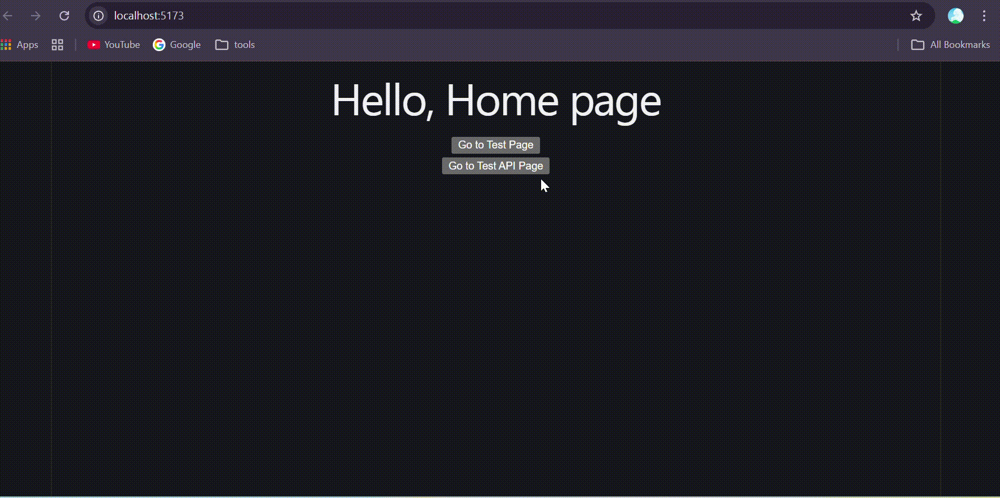

# React Tutorial Project

โปรเจกต์นี้เป็นตัวอย่างการใช้งาน React + Vite สำหรับฝึกพื้นฐานการทำเว็บแบบหน้าเดียว (SPA) พร้อมการใช้งาน React Router และการเรียก API ด้วย Axios



## สิ่งที่มีในโปรเจกต์

- ตั้งค่าโปรเจกต์ด้วย Vite
- ใช้ React Router ในการทำหลายหน้า
- เรียกข้อมูล Todo จาก Mock API
- แก้ไขชื่อ Todo
- ลบ Todo

## เทคโนโลยีที่ใช้

- React 19
- Vite
- React Router DOM
- Axios
- ESLint

## การเริ่มต้นใช้งาน

### 1) ติดตั้ง dependencies

```bash
npm install
```

### 2) รันในโหมดพัฒนา

```bash
npm run dev
```

จากนั้นเปิด URL ที่แสดงใน Terminal (ปกติจะเป็น `http://localhost:5173`)

### 3) Build สำหรับ production

```bash
npm run build
```

### 4) Preview build

```bash
npm run preview
```

### 5) ตรวจ lint

```bash
npm run lint
```

## เส้นทางหน้าเว็บ (Routes)

- `/` : หน้า Home
- `/test` : หน้า Test Page
- `/test-api` : หน้าแสดงรายการ Todo จาก API พร้อมปุ่ม Edit/Delete
- `/todo/:id` : หน้าแก้ไขข้อมูล Todo ตาม id

## API ที่ใช้งาน

ใช้ Mock API:

`https://69477a99ca6715d122fa5266.mockapi.io/todos`

ตัวอย่างการเรียก:

- `GET /todos` ดึงรายการทั้งหมด
- `GET /todos/:id` ดึงข้อมูลรายการเดียว
- `PUT /todos/:id` แก้ไขชื่อ Todo
- `DELETE /todos/:id` ลบ Todo

## โครงสร้างโปรเจกต์โดยย่อ

```text
react-tutorial/
|- public/
|- src/
|  |- components/
|  |- App.jsx
|  |- Edit.jsx
|  |- TestApi.jsx
|  |- TestPage.jsx
|  |- main.jsx
|- index.html
|- package.json
|- vite.config.js
```

## หมายเหตุ

- หน้าตัวอย่างนี้เน้นการเรียนรู้พื้นฐาน ยังไม่มีการจัดการ error/loading แบบละเอียดทุกกรณี
- หาก API ปลายทางไม่พร้อมใช้งาน หน้า `/test-api` อาจไม่แสดงข้อมูลตามคาด

